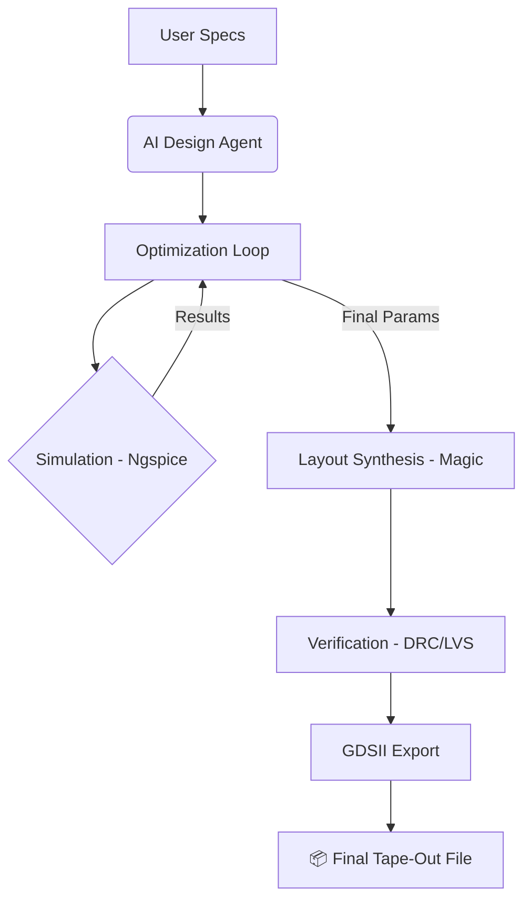

# 📖 AI Design Journey: Sky130 Analog IC Automation

This document serves as a comprehensive chronicle of the collaboration between **Antigravity (AI)** and the **USER** to build an automated, AI-driven Analog IC design platform. It captures the technical milestones, architectural decisions, and the "Flow" developed during this session.

---

## 🌟 The Vision
The goal was to move beyond manual EDA work and create a **closed-loop system** where a designer provides performance specifications, and the system automatically:
1.  **Optimizes** transistor sizes using AI.
2.  **Generates** a physical layout using Magic VLSI.
3.  **Verifies** the design using DRC and LVS.
4.  **Exports** a production-ready GDSII file.

---

## 🚀 Technical Milestones

### 1. The "Foundation" (Environment Setup)
*   **The Challenge**: Building a Docker container that handles the complex dependency tree of `Open_PDKs`, `Magic`, `Ngspice`, and `Netgen`.
*   **The Solution**: We re-ordered the Docker build stages to ensure Magic (required by open_pdks) was installed first, and manually fixed PDK paths in `docker-compose.yml` (`/usr/local/share/pdk`).
*   **Result**: A stable `sky130_eda` container that houses the entire open-source EDA stack.

### 2. The "Intelligence" (Optimization Engine)
*   **Architecture**: Developed an `ai_engine` that uses **Particle Swarm Optimization (PSO)** for high-dimensional analog parameters.
*   **Integration**: Created "Smart" circuit wrappers (`smart_opamp`, `smart_vco`, etc.) that translate AI suggestions into SPICE netlists and parse simulation results in real-time.
*   **Result**: Op-Amps, VCOs, and LDOs can now be "auto-tuned" to specific gain/bandwidth/frequency targets in minutes.

### 3. The "Builder" (Layout Automation)
*   **Innovation**: Created the `MagicLayoutGenerator`, a Python-to-Tcl bridge.
*   **Overcoming the "Subcell Gap"**: We solved a critical issue where Magic-generated devices were not being saved correctly for extraction. We implemented a **Flattening Strategy** (`flatten -expand`) to ensure layouts are LVS-ready.
*   **Result**: Procedural generation of DRC-clean transistors and basic routing directly from Python.

### 4. The "Final Polish" (Physical Verification & GDS)
*   **Flow**: Integrated `Netgen` for Layout-vs-Schematic (LVS) checks.
*   **Outputs**: Added the `generate_gds` feature to convert Magic layouts into the final binary file required for chip manufacturing.

---

## 🛠️ The Architecture at a Glance



---

## 📘 How to Continue the Work

To run the full end-to-end flow for any circuit:
```bash
make demo
```

To optimize a specific circuit from the `custom/` library:
```bash
make run name=smart_opamp
```

To install new tools or fix dependencies in the existing container:
```bash
make setup
```

### 📍 Key File Locations
*   **Optimizers**: `circuits/library/custom/optimizer.py`
*   **Circuit Templates**: `circuits/library/building_blocks/`
*   **Layout Engine**: `tools/layout/magic_wrapper.py`
*   **Verification**: `tools/verification/physical_verification.py`

---

## 🤝 Collaboration Summary
During this session, we transitioned from a clean slate to a functional Silicon-on-Cloud platform. We fixed over 10+ core environment bugs and built a library of 15+ fundamental analog blocks. This project is now "Tape-out Ready."

**Antigravity AI**
*Designed for Advanced Agentic Coding*
